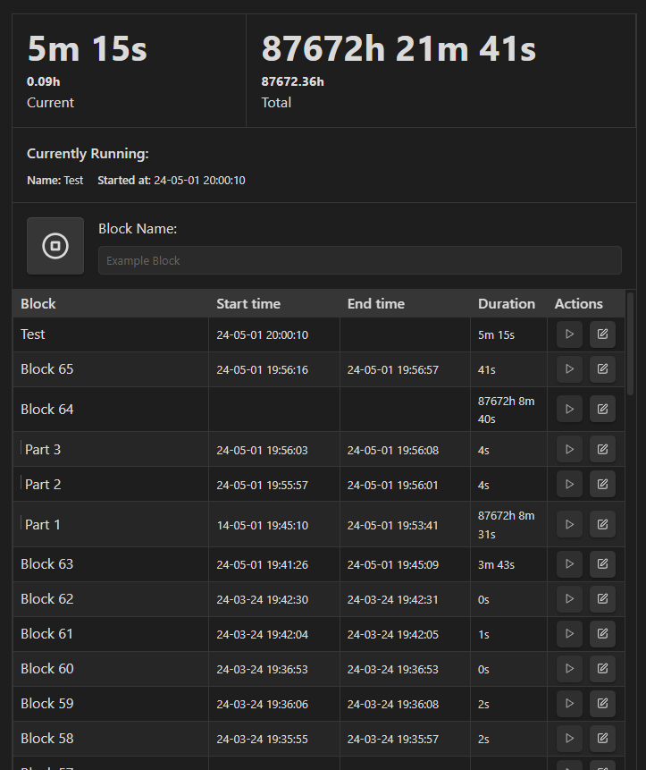
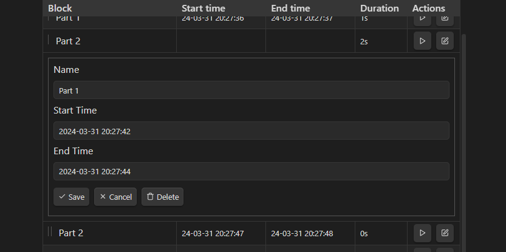
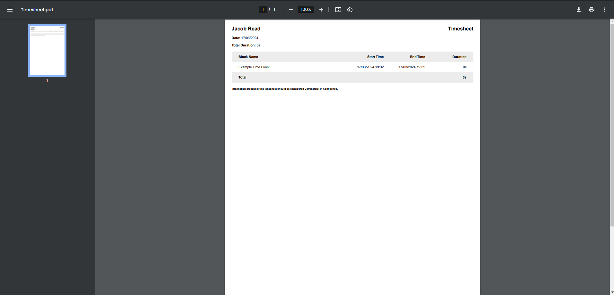

## ⌛ Obsidian Timekeep

> Obsidian plugin for time tracking


This plugin provides a simple and easy way to track time spent on various tasks. After tracking your time, you can export the tracked time as a **Markdown Table**, **CSV**, **JSON**, or **PDF**.




This plugin provides a command for inserting time trackers: `Timekeep: Insert Tracker`. Alternatively, a timekeep can be created by creating a codeblock like the following:

````
```timekeep

```
````

## ✏️ Editing & Deleting

If you accidentally gave a block an incorrect name or started the timer late, you can use the editing feature to update the stored data or delete the entry.



## 👀 How it's stored

This plugin is heavily inspired by [ObsidianSimpleTimeTracker](https://github.com/Ellpeck/ObsidianSimpleTimeTracker) (semi backwards compatible; some simple-time-tracker blocks can be renamed to timekeep), the data for time tracking is stored as JSON within the `timekeep` code block.

The time block start and stop times are stored as timestamps, making it possible for you to start your time tracker, then close Obsidian and have the tracking continue when you open it again.

Below is an example of how this is stored:

```json
{"entries":[{"name":"Example Time Block","startTime":"2024-03-17T06:32:36.118Z","endTime":"2024-03-17T06:32:37.012Z","subEntries":null}]}
```


## 📝 Export Formats

Below are the various formats that timekeeping data can be exported to:

### Markdown Table


| Block              | Start time        | End time          | Duration |
| ------------------ | ----------------- | ----------------- | -------- |
| Example Time Block | 24-03-17 19:32:36 | 24-03-17 19:32:37 | 0s       |
| **Total**          |                   |                   | **0s**   |


```md
| Block              | Start time        | End time          | Duration |
| ------------------ | ----------------- | ----------------- | -------- |
| Example Time Block | 24-03-17 19:32:36 | 24-03-17 19:32:37 | 0s       |
| **Total**          |                   |                   | **0s**   |
```

### CSV

```csv
Block,Start time,End time,Duration
Example Time Block,24-03-17 19:32:36,24-03-17 19:32:37,0s
```

> [!NOTE]
> In the plugin settings, you can choose to omit the first line of the CSV containing the column names:


### JSON

The JSON export format simply copies the JSON stored inside the timekeep:

```json
{"entries":[{"name":"Example Time Block","startTime":"2024-03-17T06:32:36.118Z","endTime":"2024-03-17T06:32:37.012Z","subEntries":null}]}
```

### Generated PDFs

Below is an example of a PDF generated by Timekeep. These PDFs are generated using react-pdf locally.



> [!NOTE]
> PDF export is not supported on mobile and will not be available. This is a limitation of the APIs available and is not a planned feature.

## 🔣 Using with templates

If you would like to create a timekeep through a template plugin, you can do so by using the JSON for a timekeep directly. 

If you have frequently used entry names you can define them in your template by specifying `null` for both the `startTime` and `endTime`:

```json
{"entries":[{"name":"Non started block","startTime":null,"endTime":null,"subEntries":null}]}
```

This will create an entry that is not yet started; you can start it by clicking the play button without having to type out the name.

## 🦾 API

Timekeep exposes a JS API which can be used by other scripts such as with [Dataview](https://blacksmithgu.github.io/obsidian-dataview/api/intro/)

You can access the plugin API through:

```js
// Get the timekeep plugin API
const timekeepPlugin = this.app.plugins.plugins.timekeep;

// Extract the timekeeps from the file text
const timekeeps = timekeepPlugin.extractTimekeepCodeblocks(text);
```

Below is a Dataview example for showing the total elapsed time for all timekeeps in the current file:

````
```dataviewjs
// Get the currently open file
const activeFile = this.app.workspace.getActiveFile();
if(!activeFile || !activeFile.name) return; 

// Read the file
const text = await this.app.vault.read(activeFile); 

// Get the timekeep plugin API
const timekeepPlugin = this.app.plugins.plugins.timekeep;

// Extract the timekeeps from the file text
const timekeeps = timekeepPlugin.extractTimekeepCodeblocks(text);

// Current time is required for unfinished entries
const currentTime = moment();

let totalRunningDuration = 0;

for (const timekeep of timekeeps) {
  totalRunningDuration += timekeepPlugin.getTotalDuration(timekeep.entries, currentTime);
}

// Total running duration is in milliseconds
dv.span(totalRunningDuration);
```
````


## Known issues

### Jumpy rendering behavior on modification

If your lists become longer you will likely see some jumpy/flickery behavior with timekeep when making modifications (add/save/delete/collapse/expand), this is a limitation of how Obsidian re-renders the app.

I am unable to take advantage of the React virtual DOM to only update the changed DOM elements for the entries, because Obsidian re-creates the entire app when the code block changes (Since the timekeep data is stored in the codeblock, modifications cause this to happen. Thus the virtual DOM and real DOM are thrown away causing a full re-render). This issue also means local state will all be lost on modification (This is why the collapsed state must be persisted to the timekeep.)


I do not believe this can be fixed but PRs are welcome if you are aware of a way to fix this. 

## 📄 License

This project is licensed under the [MIT License](./LICENSE.md)